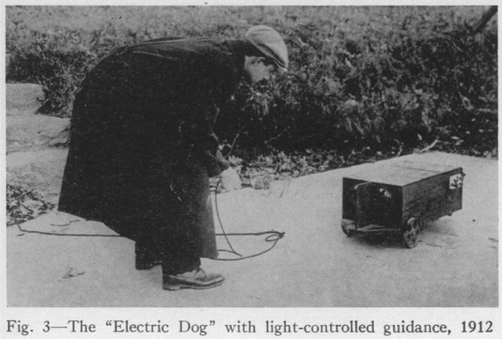

# Seleno (1912) — The Electric Dog

### A cybernetic simulation and generative art piece based on the world's first phototropic automaton.

**Live Demo:** https://davideriboli.github.io/Seleno/

> "The electric dog... might in a very near future become in truth a real 'dog of war,' without fear, without heart... with but one purpose: to reach and let out the lifeblood of anything that comes within the range of its senses." — Benjamin Franklin Miessner, 1916.

----------

## 1. Historical & Epistemological Context

**Seleno**, universally known as "The Electric Dog," represents a cornerstone in the pre-history of cybernetics and autonomous robotics. Conceived in **1912** at the Gloucester (Massachusetts) laboratory by **John Hays Hammond Jr.** and **Benjamin Franklin Miessner**, Seleno is historically recognized as the first-ever successful realization of a self-directing, light-sensitive vehicle.

### The Biological Foundation: Jacques Loeb

Unlike the pre-programmed automata of classical horology, Seleno was the physical incarnation of biologist **Jacques Loeb’s** theories on "forced movements" or tropisms. Loeb posited that animal behavior (such as a moth flying toward a flame) was not a result of will or instinct, but a deterministic mechanical response to physical-chemical stimuli. Hammond and Miessner translated this "sensory-motor architecture" into electrical circuits, prefiguring the concept of **embodied cognition** by decades.

----------

## 2. The Original Architecture (1912)

The original device was encased in a mahogany chassis and utilized a technology that was pioneering for the early 20th century:

-   **Sensory Apparatus:** Two condensing lenses with **Selenium cells** acting as the artificial "retina."
    
-   **The "Nose":** An opaque partition placed between the lenses to create the differential light gradient required for steering.
    
-   **Relay Logic:** A cascade of Weston micro-ampere relays and "Pony" power relays that implemented a purely hardware-based _if-then_ algorithm.
    
-   **Modulation:** A **dashpot** (pneumatic damper) to filter out flickering light fluctuations and a **tail switch** to invert polarity (switching between positive and negative phototropism).
    

----------

## 3. The Digital Simulation

This modern interpretation is not a mere animation, but a behavioral simulation written in **Vanilla JavaScript** that emulates the analog feedback loops of the 1912 prototype.

### Core Features:

-   **"Orthochromatic Film" Aesthetic:** A rendering style designed to mimic 1912 cinematography, featuring sepiatone grading, fractal film grain, and a material palette of mahogany, brass, and oxide red.
    
-   **Kinetic Inertia:** The chassis possesses realistic mass and friction. Movement is not instantaneous, reflecting the mechanical heaviness of the original electromechanical structure.
    
-   **Pneumatic Dashpot Simulation:** Users can adjust the steering damping level to observe the transition from unstable oscillatory behavior to smooth, stabilized tracking.
    
-   **The Synthetic Method:** Following the analysis of **Roberto Cordeschi**, the code tests the "explanatory sufficiency" of the mechanist model: Seleno reacts to its environment in a purely reactive, non-representational manner.
    

----------

## 4. Laboratory Experiment (Gamification)

To emphasize the experimental nature of the project, the simulation includes a "Laboratory Mission" based on the original tests conducted at Gloucester:

-   **Objective:** Guide Seleno back to the **Oxide Red Kennel** (The Kennel) while navigating through laboratory equipment.
    
-   **The Lantern:** The user interacts with a draggable lantern. A tap/click toggles the power, allowing for observations of Seleno in both active and resting states.
    
-   **Obstacles:** Procedurally generated crates and equipment block the path. Seleno interacts physically with these objects through inelastic collisions.
    
-   **Silent Film Feedback:** Success and introductory messages are presented in the style of early 20th-century silent film title cards.
    

----------

## 5. Technical Implementation

-   **Graphics Engine:** HTML5 Canvas 2D API.
    
-   **Zero Dependencies:** Built strictly with standard web technologies. No external frameworks (like p5.js or Three.js) were used, ensuring high performance and longevity.
    
-   **Mobile-First Architecture:** Features a responsive "Hamburger Menu" for controls and a real-time HUD (Heads-Up Display) to monitor sensor resistance (L-Cell / R-Cell).
    
-   **Homing Logic:** The steering calculation implements the inverse square law of light and accounts for the geometric "shadow" cast by the central partition.
    

----------

## References

1.  **Miessner, B. F. (1916).** _Radiodynamics: The Wireless Control of Torpedoes and Other Mechanisms_. D. Van Nostrand Co.
    
2.  **Loeb, J. (1918).** _Forced Movements, Tropisms, and Animal Conduct_. J. B. Lippincott Company.
    
3.  **Cordeschi, R. (2002).** _The Discovery of the Artificial: Behavior, Mind and Machines Before and Beyond Cybernetics_. Kluwer Academic Publishers.
    
4.  **Hammond, J. H. Jr. (1921).** _US Patent 1,387,850: System of Radiodirective Control_.
    

----------

_Created as an exploration of early cybernetic history and the synthesis of biology and engineering._
